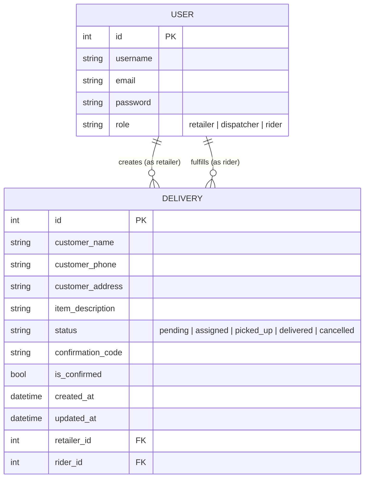

```mermaid
erDiagram
    USER {
        int id PK
        string username
        string email
        string password
        string role "retailer | dispatcher | rider"
    }

    DELIVERY {
        int id PK
        string customer_name
        string customer_phone
        string customer_address
        string item_description
        string status "pending | assigned | picked_up | delivered | cancelled"
        string confirmation_code
        bool is_confirmed
        datetime created_at
        datetime updated_at
        int retailer_id FK
        int rider_id FK
    }

    USER ||--o{ DELIVERY : "creates (as retailer)"
    USER ||--o{ DELIVERY : "fulfills (as rider)"
```