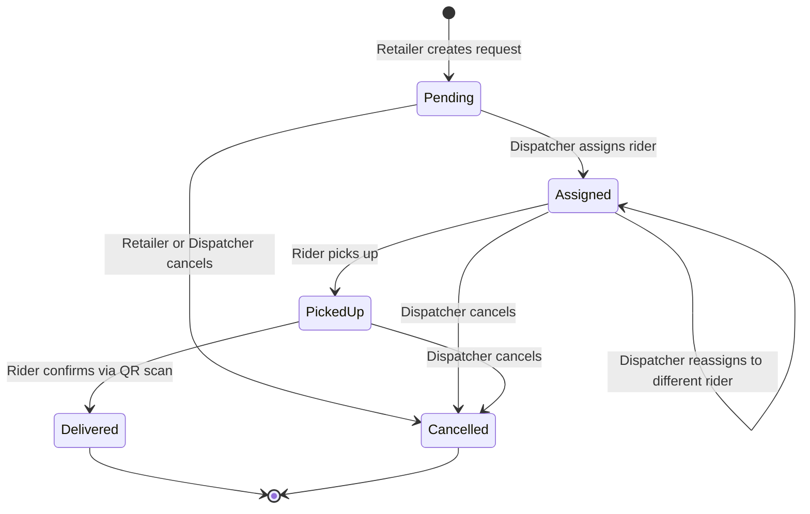

```mermaid
stateDiagram-v2
    [*] --> Pending : Retailer creates request

    Pending --> Assigned : Dispatcher assigns rider
    Pending --> Cancelled : Retailer or Dispatcher cancels

    Assigned --> PickedUp : Rider picks up
    Assigned --> Assigned : Dispatcher reassigns to different rider
    Assigned --> Cancelled : Dispatcher cancels

    PickedUp --> Delivered : Rider confirms via QR scan
    PickedUp --> Cancelled : Dispatcher cancels

    Delivered --> [*]
    Cancelled --> [*]
```