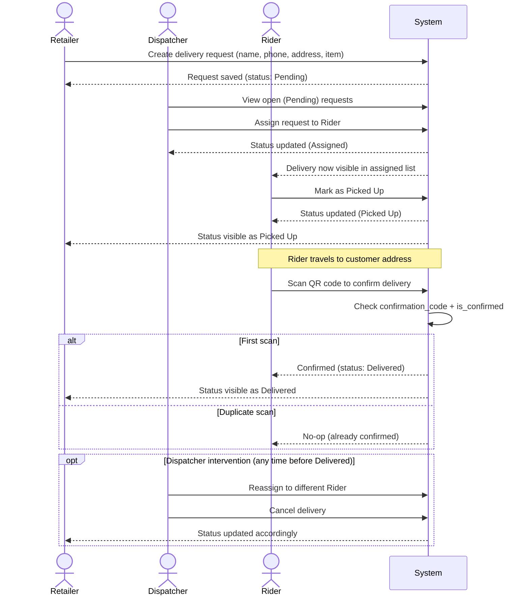

```mermaid
sequenceDiagram
    actor Retailer
    actor Dispatcher
    actor Rider

    Retailer->>System: Create delivery request (name, phone, address, item)
    System-->>Retailer: Request saved (status: Pending)

    Dispatcher->>System: View open (Pending) requests
    Dispatcher->>System: Assign request to Rider
    System-->>Dispatcher: Status updated (Assigned)
    System-->>Rider: Delivery now visible in assigned list

    Rider->>System: Mark as Picked Up
    System-->>Rider: Status updated (Picked Up)
    System-->>Retailer: Status visible as Picked Up

    Note over Rider,System: Rider travels to customer address

    Rider->>System: Scan QR code to confirm delivery
    System->>System: Check confirmation_code + is_confirmed

    alt First scan
        System-->>Rider: Confirmed (status: Delivered)
        System-->>Retailer: Status visible as Delivered
    else Duplicate scan
        System-->>Rider: No-op (already confirmed)
    end

    opt Dispatcher intervention (any time before Delivered)
        Dispatcher->>System: Reassign to different Rider
        Dispatcher->>System: Cancel delivery
        System-->>Retailer: Status updated accordingly
    end
```